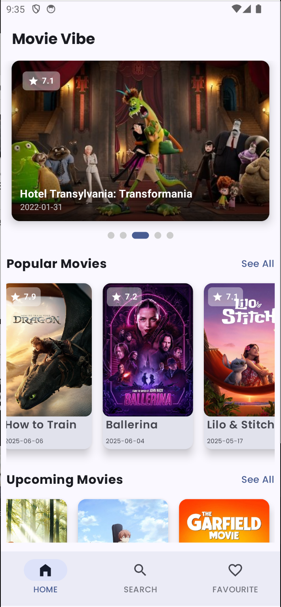
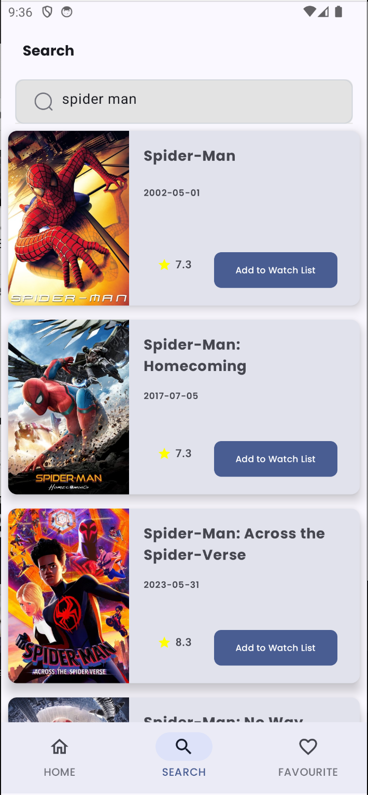
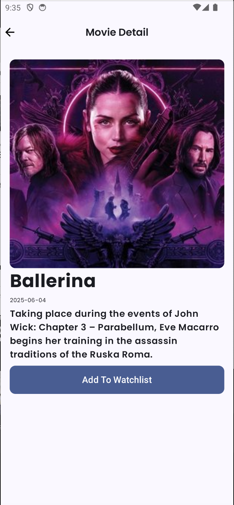

# 🎬 Movie Vibe

**Movie Vibe** is a modern Android movie browsing app built with **Kotlin** and **Jetpack Compose**, using **The Movie Database (TMDB) API** to fetch real-time movie data. Explore top-rated, popular, and upcoming movies — all in one clean, performant UI.

  

---

## ✨ Features

- 🔥 Browse **Top Rated**, **Popular**, and **Upcoming** movies
- 🔍 Search movies with live results
- 📄 View detailed info: title, overview, release date, rating
- ⚡ Efficient paging using **Paging 3 + RemoteMediator**
- 🌙 Fully built with **Jetpack Compose**

---

## 🧰 Tech Stack

| Tool / Library     | Role                                 |
|--------------------|--------------------------------------|
| Kotlin             | Programming language                 |
| Jetpack Compose    | Modern UI Toolkit                    |
| Paging 3           | Pagination from TMDB API             |
| RemoteMediator     | Remote + local data sync             |
| MVVM               | Architecture pattern                 |
| Hilt               | Dependency Injection                 |
| Retrofit           | HTTP client for API calls            |
| Coil               | Image loading                        |

---

## 📸 Screenshots

  
  
  

---
